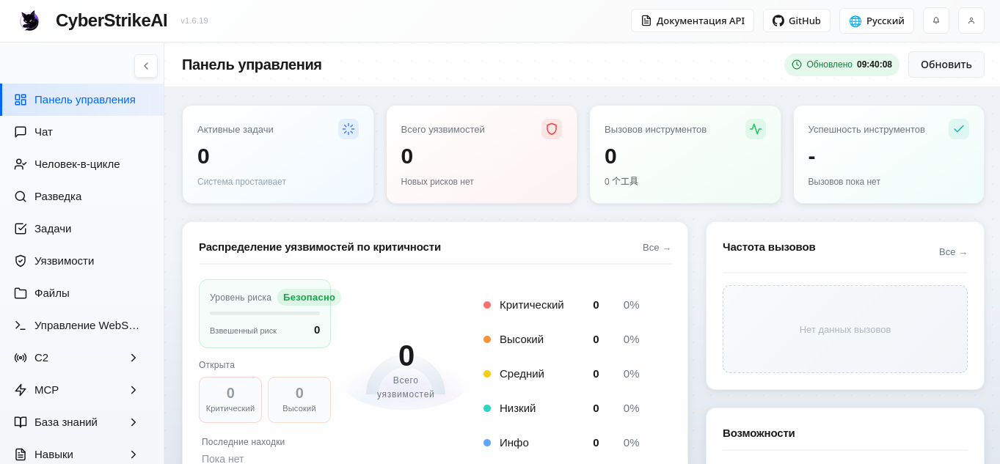
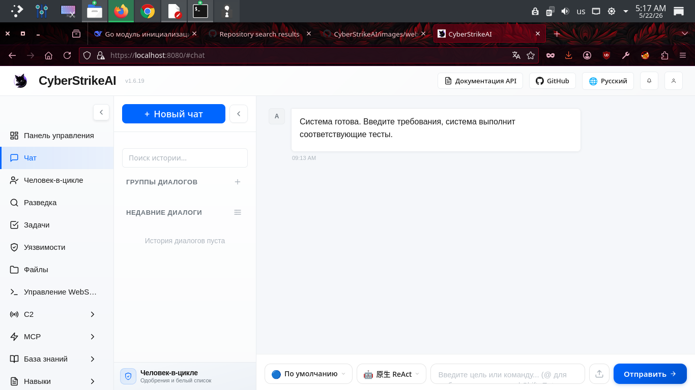
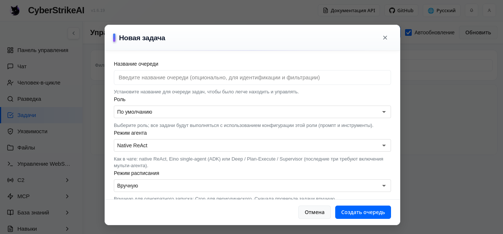
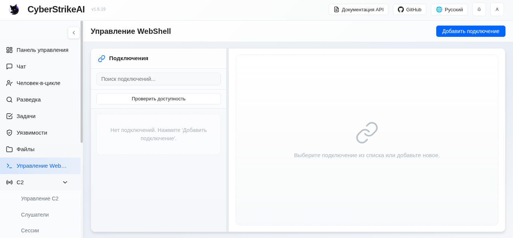
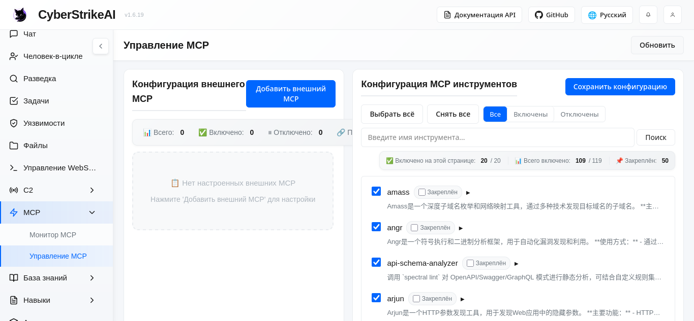
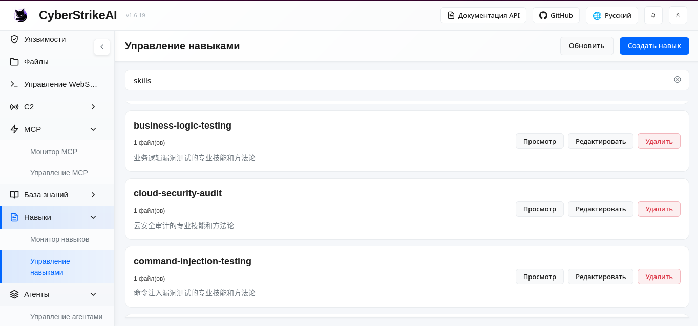
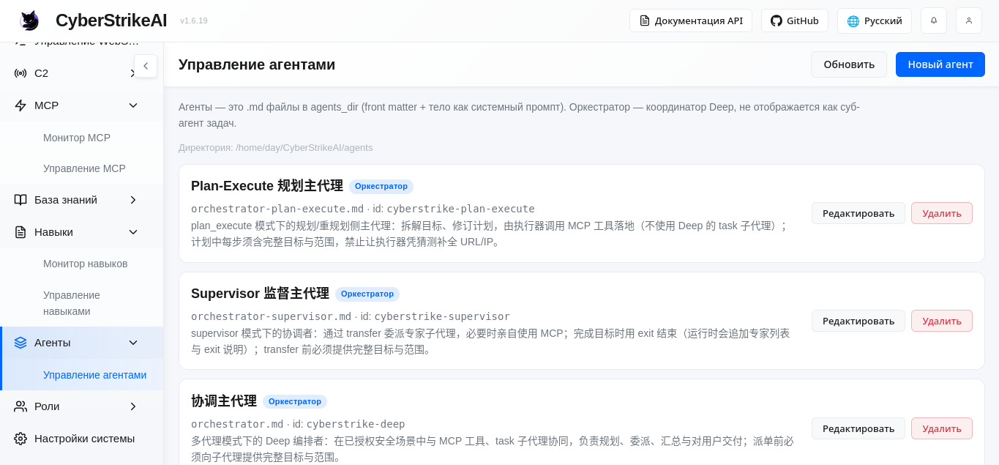

<div align="center">
  

# Кибератака

[中文](README_CN.md) | [Английский](README.md)

**Сообщество**: [Присоединяйтесь к нам в Discord](https://discord.gg/8PjVCMu8Zw)

CyberStrikeAI - это платформа для тестирования безопасности на базе искусственного интеллекта, встроенная в Go. Он объединяет более 100 инструментов безопасности, интеллектуальный механизм оркестровки, тестирование на основе ролей с предопределенными ролями безопасности, систему навыков со специализированными навыками тестирования и комплексные возможности управления жизненным циклом. Благодаря встроенному протоколу MCP и агентам искусственного интеллекта он обеспечивает комплексную автоматизацию - от диалоговых команд до обнаружения уязвимостей, анализа цепочки атак, извлечения знаний и визуализации результатов - обеспечивая проверяемую, отслеживаемую среду совместного тестирования для служб безопасности.


## Предварительный просмотр интерфейса и интеграции

<div align="center">

### Обзор системной панели мониторинга



*Панель мониторинга предоставляет полный обзор состояния системы во время выполнения, уязвимостей в системе безопасности, использования инструментов и базы знаний, помогая пользователям быстро разобраться в основных функциях платформы и текущем состоянии.*

### Обзор основных функций

<tr>
<td width="33,33%" align="center">
<strong>Веб-консоль</strong><br/>

</td>
<td width="33,33%" align="center">
<strong>Управление задачами</strong><br/>

</td>
<td width="33,33%" align="center">
<strong>Управление уязвимостями</strong><br/>

</td>
</tr>
<tr>
<td width="33,33%" align="center">
<strong>Управление веб-оболочкой</strong><br/>

</td>
<td ширина="33,33%" align="center">
<strong>Управление MCP</strong><br/>

</td>
<td width="33,33%" align="center">
<strong>База знаний</strong><br/>

</td>
</tr>
<tr>
<td width="33,33%" align="center">
<strong>Управление навыками</strong><br/>

</td>
<td width="33,33%" align="center">
<strong>Управление агентами</strong><br/>

</td>
<td width="33,33%" align="по центру">
<strong>Управление ролями</strong><br/>

</td>
</tr>
<tr>
<td width="33,33%" align="center">
<strong>Системные настройки</strong><br/>

</td>
<td width="33,33%" align="center">
<strong>Режим MCP stdio</strong><br/>

</td>
<td width="33.33%" align="center">
<strong>Плагин Burp Suite</strong><br/>

</td>
</tr>
</таблица>

деленья

## Основные моменты

- 🤖 Механизм принятия решений с использованием искусственного интеллекта с моделями, совместимыми с OpenAI (GPT, Claude, DeepSeek и т.д.)
- 🔌 Собственная реализация протокола MCP с транспортными средствами HTTP/stdio/SSE и внешней федерацией MCP.
- 🧰 Более 100 готовых рецептов инструментов + система расширений на основе YAML
- 📄 Разбивка на страницы с большим количеством результатов, сжатие и поиск в архивах
- 🔗 График цепочки атак, оценка рисков и пошаговое воспроизведение
- 🔒 Защищенный паролем веб-интерфейс, журналы аудита и сохранение данных в SQLite
- 📚 База знаний с векторным поиском и гибридным извлечением для повышения уровня безопасности
- Группировка сообщений с закреплением, переименованием и пакетным управлением
- Управление уязвимостями с помощью CRUD-операций, отслеживания серьезности, рабочего процесса состояния и статистики
- Управление пакетными задачами: создание очередей задач, добавление нескольких задач и их последовательное выполнение
- 🎭 Тестирование на основе ролей: предопределенные роли для тестирования безопасности (тестирование на проникновение, CTF, сканирование веб-приложений и т.д.) с пользовательскими подсказками и ограничениями на инструменты
- 🧩 ** Мультиагентный режим (Eino DeepAgent)**: необязательная оркестровка, при которой координатор делегирует работу субагентам, определенным Markdown, с помощью инструмента "задача"; главный агент в "agents/orchestrator.md" (или "kind: orchestrator"), субагенты в `агенты/*.md"; режим чата переключается, когда значение "multi_agent.enabled" равно true (см. [Документ о мультиагентах](docs/MULTI_AGENT_EINO.md)).
- 🎯 Система навыков: более 20 предопределенных навыков тестирования безопасности (SQL-инъекция, XSS, безопасность API и т.д.), которые могут быть привязаны к ролям или вызываться по требованию агентами искусственного интеллекта
- 📱 ** Чат-бот **: DingTalk и Lark (Feishu) поддерживают длительную связь, поэтому вы можете общаться с CyberStrikeAI с мобильного устройства (настройки и команды см. в [Руководстве по роботам / чат-ботам] (docs/robot_en.md)).
 - 🐚 ** Управление WebShell **: добавление подключений WebShell и управление ими (например, совместимость с IceSword / AntSword), использование виртуального терминала для выполнения команд, встроенного файлового менеджера для операций с файлами и вкладки AI assistant, которая организует тесты и ведет историю разговоров для каждого соединения; поддерживает PHP, ASP, ASPX, JSP и пользовательские типы оболочек с настраиваемым методом запроса и командным параметром.

## Плагины

CyberStrikeAI включает в себя дополнительные возможности интеграции в разделе "плагины/".

- **Расширение Burp Suite**: "плагины/burp-suite/cyberstrikeai-burp-extension/"  
  Выходные данные сборки: "plugins/burp-suite/cyberstrikeai-burp-extension/dist/cyberstrikeai-burp-extension.jar`  
  Документы: "плагины/burp-suite/cyberstrikeai-burp-extension/README.md"

## Обзор инструментов

CyberStrikeAI поставляется с более чем 100 специально разработанными инструментами, охватывающими всю цепочку убийств:

- **Сетевые сканеры** – nmap, massscan, rustscan, arp-сканирование, nbtscan
- ** Веб-сканеры и сканеры приложений ** – sqlmap, nikto, dirb, gobuster, feroxbuster, ffuf, httpx
- **Сканеры уязвимостей** – nuclears, wpscan, wafw00f, dalfox, xsser
- **Перечисление поддоменов** – поиск, накопление, findomain, dnsenum, fierce
- **Поисковые системы в сетевом пространстве** – fofa_search, zoomeye_search
- **Безопасность API** – graphql-сканер, arjun, api-фаззер, api-анализатор схем
- **Безопасность контейнеров ** – trivy, clair, docker-bench-security, kube-bench, kube-hunter
- **Облачная безопасность ** – prowler, scout-suite, cloudmapper, pacu, terrascan, checkov
- **Бинарный анализ ** – gdb, radare2, ghidra, objdump, strings, binwalk
- **Эксплуатация** – metasploit, msfvenom, pwntools, ropper, ropgadget
- **Взлом пароля** – hashcat, Джон, hashpump
- **Криминалистика** – изменчивость, volatility3, foremost, steghide, exiftool
- **Постэксплуатация** – linpeas, winpeas, mimikatz, bloodhound, impacket, реагент
- ** Утилиты CTF** – stegsolve, zsteg, хэш-идентификатор, fcrackzip, pdfcrack, cyberchef
- **Системные помощники** – exec, create-file, delete-file, list-files, modify-file

## Базовое использование

### Быстрый запуск (развертывание одной командой)

**Предварительные требования:**
- Перейти на версию 1.21+ ([Установить](https://go.dev/dl/))
- Python 3.10+ ([Установить](https://www.python.org/downloads/))

**Развертывание с помощью одной команды:**
``
клонирование bash git
https://github.com/Ed1s0nZ/CyberStrikeAI.git cd CyberStrikeAI
chmod +x run.sh && ./run.sh
```

Сценарий `run.sh` автоматически запустится:
- ✅ Проверки и питона среды
- ✅ Создавать виртуальные среды Python
- ✅ Установить зависимости Python 
- ✅ Скачать GO зависимостей
- ✅ Построение проекта
- ✅ Запустить сервер

**Впервые Конфигурации:**
1. **Настройте API, совместимый с OpenAI** (требуется перед первым использованием)
   - Открыть http://localhost:8080 после запуска
   - Перейдите в "Настройки" → Введите свои учетные данные API:
     "`yaml
     openai:
       api_key: "введите свой ключ"
       base_url: "https://api.openai.com/v1" # или https://api.deepseek.com/v1
       модель: "gpt-4o" # или deepseek-чат, claude-3-opus и т.д.
     ```
   - Или отредактируйте `config.yaml` непосредственно перед запуском
2. **Войдите в систему** - Используйте автоматически сгенерированный пароль, указанный в консоли (или задайте "auth.password" в "config.yaml")
3. **Установите средства защиты (необязательно)** - Установите необходимые инструменты:
   ``bash
   # macOS
   создаем и устанавливаем nmap sqlmap nuclears httpx gobuster feroxbuster subfinder для накопления
   # Ubuntu/Debian
sudo apt-получить установку nmap sqlmap ядер httpx gobuster feroxbuster
   ```
   Искусственный интеллект автоматически переходит к альтернативным методам, когда инструмент отсутствует.

**Альтернативные методы запуска:**
``bash
# Прямой запуск Go (требуется ручная настройка)
запустите cmd/server/main.go

# Ручная сборка
go build -o cyberstrike-ai cmd/server/main.go
./cyberstrike-ai
```

**Примечание:** Виртуальная среда Python (`venv/`) автоматически создается и управляется с помощью `run.sh`. Инструменты, для которых требуется Python (например, `api-fuzzer`, `http-framework-test` и т.д.), будут автоматически использовать эту среду.

### Обновление версии (без критических изменений)

**Рекомендуется обновить CyberStrikeAI в один клик (рекомендуется):**
1. (В первый раз) включите скрипт: `chmod +x upgrade.sh`
2. Обновите с помощью: `./upgrade.sh (необязательные флаги: `--tag vX.Y.Z`, `--no-venv`, `--preserve-custom`, `--yes`)
3. Скрипт создаст резервную копию вашего файла `config.yaml" и "data/", обновит код из версии GitHub, обновит версию "config.yaml", а затем перезапустит сервер.

Рекомендуется однострочный вариант:
`chmod +x upgrade.sh && ./upgrade.sh --да`

Если что-то пойдет не так, вы можете выполнить восстановление из ".upgrade-backup/" (или вручную скопировать "/data" и "config.yaml" обратно) и снова запустить "./run.sh`.

Требования / советы:
* Для загрузки обновленных пакетов вам потребуется "curl" или "wget".
* Рекомендуется использовать "rsync" для безопасной синхронизации кода.
